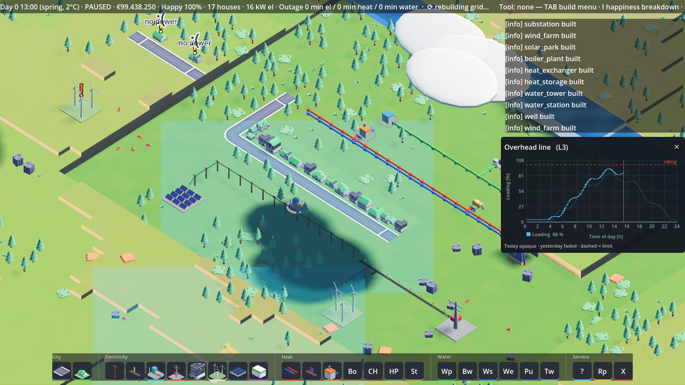
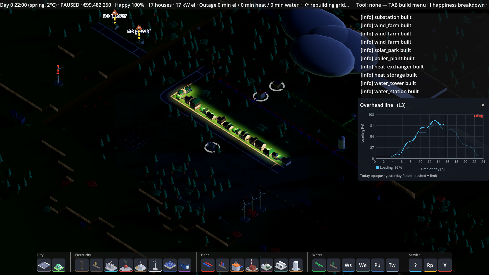

# infrastruct — a city-builder that runs on real physics


> [!NOTE]
> **AI-generated code.** The source code, tests and documentation of this
> game — including the co-simulation contract and the balancing sheets — were
> written by an AI coding agent (Claude Code, Anthropic), working under human
> direction: a person specified the requirements and domain decisions, reviewed
> the results and verified every feature live against the running game. Treat
> it accordingly — read before you trust.

infrastruct is a SimCity-style city-builder (Godot 4, GDScript) where every
house needs **electricity, heat and drinking water** — and none of it is faked.
Each network is solved by a real engineering solver running as a co-simulation
sidecar: power flow by [pandapower](https://github.com/e2nIEE/pandapower),
district heating and pressurized drinking water by
[pandapipes](https://github.com/e2nIEE/pandapipes). Outages, voltage sag, cold
far-ends, pressure collapse, storage behavior — all of it comes out of the
solvers, never out of a script.

| ☀️ 13:00 — the demo town | 🌙 22:00 — power-driven window lights |
|---|---|
|  |  |

The design premise: **if the physics says it, the city shows it.** A tripped
20-kV branch de-energizes its substation's zone and the affected houses raise
💩 "no power" bubbles; a dead-end heat pipe is rejected by the hydraulics; an
empty water tower collapses the boundary head and the frames come back
`degraded`. The inspector opens a daily profile graph on any building, house,
line or pipe — solved loading against its rating (for homes: their expected
consumption and rooftop-PV infeed), today opaque, yesterday faded.

A German printable user manual ships with each backend
(`docs/Benutzerhandbuch.pdf` in the backend repos, served at `GET /manual`).
Developer documentation: the wire contract
[`docs/contract/v1.md`](docs/contract/v1.md) (authoritative), decisions in
[`docs/adr/`](docs/adr/), the master plan in [`ROADMAP.md`](ROADMAP.md);
`CLAUDE.md` is the exhaustive development log.

---

## The four moving parts

| Part | What it is | Solver | Port |
|------|-----------|--------|------|
| **game** (`game/`) | the Godot 4.7 city-builder (owns the clock) | — | — |
| **power** ([`backends/rtpowerflow`](https://github.com/markisbell/rtpowerflow)) | realtime distribution-grid service | pandapower | 8010 |
| **heat** ([`backends/rtheatflow`](https://github.com/markisbell/rtheatflow)) | realtime district-heating service | pandapipes (heat) | 8011 |
| **water** ([`backends/rtwaterflow`](https://github.com/markisbell/rtwaterflow)) | realtime drinking-water service | pandapipes (hydraulics, PDD) | 8012 |

The backends are full standalone teaching platforms in their own right (each
with its own UI, REST/WebSocket API and validation suite); infrastruct pins
them as submodules on their `gamebridge` branches and runs them in **puppet
mode**: the game owns time (15-minute steps, 96 per day), steps every network
over WebSocket, and routes coupling flows (a heat plant's electric demand, a
pump's power draw) from one solver into the next step of the other.

---

## What it can do

- **Draw networks like roads.** Overhead lines vs buried cables, surface vs
  buried pipes — drag to sketch, blocked tiles turn red, only the green prefix
  builds. Buried utilities cross under roads on manhole plates; nothing runs
  under houses. Kind transitions become real junction buses in the solved grid.
- **Real ratings, real consequences.** 110/20-kV grid connection (20 MVA),
  20/0.4-kV Ortsnetzstationen (630 kVA) as real transformer elements, catalog
  line types with actual MVA limits. MW-scale generation — 3-MW wind turbines
  placed one by one, a 1.2-MWp solar park — is what overloads MV lines;
  household districts alone barely register.
- **A demand model with a shape — and weather.** Zone load = BDEW H0 base +
  EV home charging (gaussian arrival, workday peak ~19:00) − rooftop PV on
  measured day shapes, where the seeded cloud field decides HOW sunny each
  day's shape is: overcast skies visibly dim rooftop and park dispatch alike.
  Sunny noon exports; the battery peak-shaves against its own moving average;
  gas covers the residual.
- **Power islands.** A district with no grid connection stays alive if it has
  a grid-forming source — a battery inverter or a gas plant; wind and solar
  alone are grid-following and stay dark. The former becomes that island's
  slack in the real power flow, and a microgrid EMS keeps the balance:
  renewables curtail when the battery can't absorb more, reserve gas starts
  before load shedding, zones shed in rotation when generation runs short,
  and a drained island black-starts once its battery recovers.
- **Signals, trips and repair crews.** Capacity warnings float over lines ≥80 %,
  transformers ≥70 %, cold heat far-ends and low water pressure. Sustained
  overloads trip the branch and do NOT self-heal — send a repair crew (€1 500,
  2 h) and watch the zone come back.
- **An economy that balances.** Tariffs on delivered kWh/m³, fuel from solved
  outputs, upkeep, wholesale import/feed-in, loans. A blackout day books zero
  electricity income. The balancing sheet is a contract:
  [`tools/balancing/economy.md`](tools/balancing/economy.md).
- **Seeded, deterministic events.** MTBF equipment failures, storms at real
  turbine cut-out speed, heat waves, frost, drought, W 405 fire flow, pipe
  bursts with leak draw — off in tests, on in the sandbox.
- **Scenarios.** Sandbox, a 9-step tutorial, greenfield, an inherited relic
  grid that loses by misery if left untouched, an energy-transition path,
  and an off-grid village living entirely on its battery-formed microgrid.
- **A living map.** Procedural terrain with rivers (wells near water yield
  more), groves and stone fields, clouds that drift with a slowly veering
  wind (small grey arrows show its direction, turbines yaw to face it and
  spin with its strength), real cloud shadows, a full day/night cycle where
  window lights follow the power state of the house — and households that
  raise a 💩 bubble when the power or the heating lets them down.

---

## Run it

### Prebuilt (no Python, no Godot)

Grab the **Windows installer** or the **Linux tarball** from
[Releases](../../releases). Extract/install and run — the game starts and
supervises its three frozen solver backends itself (127.0.0.1:8010–8012) and
shuts them down with the window.

```bash
# Linux
tar -xzf infrastruct-<v>-linux-x86_64.tar.gz
cd infrastruct && ./infrastruct.x86_64        # needs glibc 2.36+, Vulkan GPU
```

### From source

Prerequisites once: Godot 4.7.1 in `.tools/godot/`, submodules, and one
[uv](https://github.com/astral-sh/uv) venv per backend (their pandapower pins
conflict — keep them separate):

```bash
git submodule update --init
uv venv --python 3.12 .venv        && uv pip install --python .venv/bin/python        -e "backends/rtpowerflow[dev]"  numba
uv venv --python 3.12 .venv-heat   && uv pip install --python .venv-heat/bin/python   -e "backends/rtheatflow[dev]"   numba
uv venv --python 3.12 .venv-water  && uv pip install --python .venv-water/bin/python  -e "backends/rtwaterflow[dev]"  numba
./start_game.sh                    # Windows: start_game.bat
```

### Tests

```bash
# GdUnit suite (import pass first on a fresh checkout)
.tools/godot/Godot_v4.7.1-stable_linux.x86_64 --headless --path game --import
.tools/godot/Godot_v4.7.1-stable_linux.x86_64 --headless --path game -s res://addons/gdUnit4/bin/GdUnitCmdTool.gd -a res://tests --ignoreHeadlessMode
# headless smokes — one JSON verdict line each (sidecars, cosim, overload,
# coldsnap, drought, economy, scenarios, playtest monkey, ...)
.tools/godot/Godot_v4.7.1-stable_linux.x86_64 --headless --path game -- --smoke=sidecars
# shared golden-file contract suite across all four backends
.venv/bin/python -m pytest tests/contract -q
```

---

## Architecture

```
        GameClock (15-min steps, 96/day)
              │ sim step
              ▼
  City ─► Orchestrator ─► WS /gb/ws per network ─► sidecars in puppet mode
   │          │  one-step lag, at most one            rtpowerflow · rtheatflow · rtwaterflow
   │          │  in-flight step per network           (spawned + supervised, health-polled,
   │          └─ coupling: net A's output at t−1      auto-restarted with backoff)
   │             becomes net B's load at t
   ▼
  WorldModel (single source of truth: logical tiles)
              │
      topology builders ─► backend-native network docs (buses, pipes, trafos)
```

Key design choices: **the game owns time** — backends run with
`*_EXTERNAL_CLOCK=true` and never tick themselves; **divergence is data**
(`converged | degraded | failed` on every frame), never an HTTP error, so a
collapsing network is a gameplay event instead of a crash; **the WorldModel is
the source of truth** — views only render, and solvers are reset *from* the
model, which is why killing a backend mid-game costs nothing but a few
`degraded` frames (there is an e2e test that does exactly that). The wire
contract is versioned and pinned by a golden-file suite that runs against all
three real backends plus a mock.

---

## Validation

infrastruct inherits its physics from the three backends, each validated
upstream in its own repo: **rtpowerflow** is benchmarked against OpenDSS
(EPRI) and MATPOWER 8.1 (agreement to ≈ 5e-7 pu per step on full simulated
days); **rtheatflow** against the DESTEST district-heating benchmark and
measurements; **rtwaterflow** against EPANET via wntr (pressure-driven-demand
oracles). The game-side smokes then pin the *integration* physics: tower
height vs pressure (Δbar exact to two decimals), storage SoC across
save/load, feeder trips at the amperage the size test winds up to.

---

## Credits

Every solved frame in this game is pandapower or pandapipes doing the actual
work. Both are developed by Fraunhofer IEE and the University of Kassel
([e2nIEE](https://github.com/e2nIEE)) — if you build on this project, cite
them the way they ask:

- **pandapower** — L. Thurner, A. Scheidler, F. Schäfer et al., "pandapower —
  an Open Source Python Tool for Convenient Modeling, Analysis and
  Optimization of Electric Power Systems", *IEEE Transactions on Power
  Systems*, vol. 33, no. 6, pp. 6510–6521, Nov 2018.
  [doi:10.1109/TPWRS.2018.2829021](https://doi.org/10.1109/TPWRS.2018.2829021)
- **pandapipes** — D. Lohmeier, D. Cronbach, S. R. Drauz, M. Braun,
  T. M. Kneiske, "pandapipes: An Open-Source Piping Grid Calculation Package
  for Multi-Energy Grid Simulations", *Sustainability*, vol. 12, no. 23,
  art. 9899, 2020.
  [doi:10.3390/su12239899](https://doi.org/10.3390/su12239899)

---

## License

The game source, tests and documentation are licensed under the
[MIT License](LICENSE); the three backends are MIT-licensed in their own
repos. All runtime dependencies are permissively licensed — the solvers
[pandapower](https://github.com/e2nIEE/pandapower) and
[pandapipes](https://github.com/e2nIEE/pandapipes) (BSD) are *operated* as
separate sidecar processes via FastAPI/uvicorn services (MIT/BSD); see each
backend repo for its full dependency notes. 3-D props and road pieces are
from [Kenney](https://kenney.nl) asset packs (CC0).
