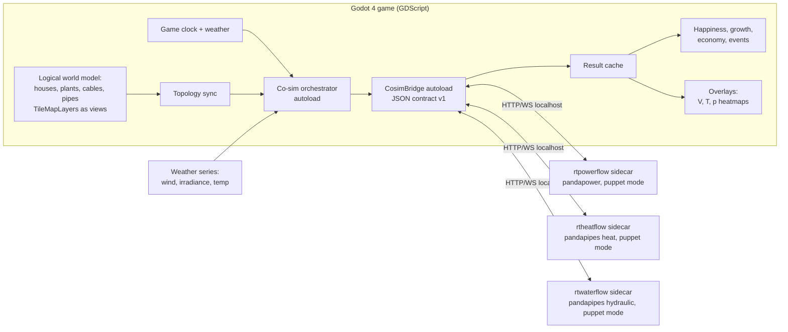

# SimGames — Implementation Roadmap (v2, Godot)

**A city-builder built on Godot 4 with physically sound utility simulation
(electricity via [rtpowerflow](https://github.com/markisbell/rtpowerflow), heat via
[rtheatflow](https://github.com/markisbell/rtheatflow), water via
[rtwaterflow](https://github.com/markisbell/rtwaterflow)).**

> **v2 note (2026-07-28):** the engine decision changed from "fork OpenTTD" to
> **Godot 4**, based on the evaluation in
> [docs/engine-recommendation.md](docs/engine-recommendation.md) and
> [docs/engine-evaluation-notes.md](docs/engine-evaluation-notes.md) (recorded as ADR-001).
> The co-simulation contract, backend puppet-mode work, aggregation design, and all
> gameplay phases survive from v1 unchanged; the engine-facing sections and Phases 0–2
> are rewritten. The v1 risk register's #1 item (OpenTTD map-array surgery) is gone.
>
> **v2.1 note (2026-07-28):** water is served by the **existing**
> [rtwaterflow](https://github.com/markisbell/rtwaterflow) backend (same architecture
> family as the other two) instead of a service we build ourselves — §2.7 and Phase 5
> rewritten accordingly; the interim in-game flow-balance water model is dropped.

This document is written to be executed by a coding agent, phase by phase. Each phase has
a goal, concrete tasks, and acceptance criteria that can be verified by running something.
Do not start a phase before the previous phase's acceptance criteria pass.

---

## 1. Vision

A SimCity-style game where the player builds a city **and** the infrastructure that keeps it
alive. Houses only function when supplied with electricity, heat, and water. Supply is not
an abstraction: an actual AC power flow (pandapower) and an actual thermo-hydraulic
simulation (pandapipes) run behind the game. Consequences are physical:

- No wind + no sun + empty battery → load shedding → dark houses → unhappy inhabitants.
- Undersized district-heating pipe → supply temperature collapses at the network edge in
  January → cold houses at the end of the line, warm ones near the plant.
- Pumping station loses electricity → water pressure drops → cascading outage across networks.
- Demand is diurnal, weekly, and seasonal (heating demand follows outdoor temperature via
  heating curves; PV follows irradiance; wind follows wind speed).

Happiness, town growth, and the economy hang off supply quality metrics (outage minutes,
voltage/pressure/temperature violations at the consumer).

---

## 2. Architecture (read before writing any code)

### 2.1 Engine: Godot 4 (decided — ADR-001)

Godot 4.x (latest stable), MIT-licensed, primary language **GDScript** (Python-like,
matches the team's stack; ADR-004 revisits C# only if profiling demands it). What Godot
provides vs. what we build:

| From Godot | Used for |
|---|---|
| `TileMapLayer` with isometric mode + per-tile custom data | World, terrain, buildings, network overlays — no map-bit scarcity, ever |
| `HTTPRequest`, `HTTPClient`, `WebSocketPeer`, native JSON | The entire solver bridge — no C++, no external HTTP library |
| `OS.create_process` / `OS.kill` | Sidecar lifecycle management |
| Control-node UI, theming | All game UI |
| CanvasLayer + shaders | Voltage/temperature/pressure heatmap overlays |
| Headless mode (`godot --headless`) | CI and scripted e2e tests |
| Export templates (Win/Linux/macOS/web) | Packaging |

| Built by us (was "free" in the OpenTTD plan) | Where |
|---|---|
| Minimal city layer: zoning, house spawning, road tool | Phase 3 |
| Game clock, calendar, seasons | Phase 1 |
| Save/load of game state | Phase 1 skeleton, hardened Phase 8 |
| Terrain elevation model (simple per-tile height integer, feeds water solver) | Phase 0 ADR-002, Phase 5 |
| Growth/happiness mechanics | Phases 3/6 (was a rewrite in v1 anyway) |

**Core architectural rule:** the **logical world model** (tiles, networks, buildings,
zones) lives in plain GDScript data structures as the single source of truth —
serializable and unit-testable headless. `TileMapLayer`s are *views* of that model, never
the model itself. Placeholder art: Kenney CC0 isometric packs until an art pass.

### 2.2 Physics backends: externally-clocked sidecar services (unchanged from v1)

All three backends — `rtpowerflow` (port 8000), `rtheatflow` (8001), and `rtwaterflow`
(8002) — remain **separate Python processes**, launched and supervised by the game, spoken
to over localhost HTTP + WebSocket (their existing FastAPI stack). Reasons:

- All three already implement the hard part: build-network-once, cheap warm-started
  re-solve per step, runtime equipment mutation (batteries, PV, heat pumps, storages,
  pumps, tanks), non-convergence handling (retry ladders in rtheatflow and rtwaterflow),
  weather-compensated heating curves, pressure-driven water demand.
- No rewrite of numerics; backends stay independently testable with their pytest suites;
  the solvers keep evolving in their own repos; the game pins versions.

**The one structural change needed in all three repos: a "puppet mode".** Today each runs
its own accelerated wall-clock tick loop. The game must own time. Each backend gets an
external stepping mode: internal scheduler disabled, and the orchestrator calls
`POST /step {sim_time, boundary_conditions}` → returns the solved `StepResult`.
This is additive (a config flag + a few endpoints), not a refactor.

### 2.3 The bridge: one co-simulation contract

All game↔solver traffic goes through a single Godot **autoload** (`CosimBridge`, GDScript)
speaking a versioned JSON contract (§5). The game never knows pandapower/pandapipes exist;
the backends never know Godot exists. The contract is engine-agnostic by design — it
already survived one engine change unscathed.

### 2.4 Aggregation layer (critical for performance and sanity)

Individual houses are **not** individual buses/junctions. The game groups buildings into
**supply zones** (per street block / per secondary substation / per heat substation). One
zone = one consumer node in the solver network. Zone demand = sum of its buildings'
profiles. This bounds solver networks to O(100–500) nodes regardless of city size —
comfortably within pandapower/pandapipes per-step budgets — and matches how real
distribution grids are modeled anyway.

### 2.5 Time coupling

- The game clock (our own calendar/season system, Phase 1) emits **sim-steps** (default:
  1 solver step per 15 in-game minutes, configurable, scaled by game speed).
- Stepping is **asynchronous with one-step lag**: at sim-time *t* the game sends boundary
  conditions and immediately continues using results from *t−1*. Godot's `HTTPRequest` is
  non-blocking by nature; results arrive via signal and are queued for the game logic.
  The frame loop never waits on Python.
- Cross-network coupling (heat pump & water pump electric load, CHP electric output) is
  loose Gauss–Seidel: values from step *t−1* of network A are boundary conditions for step
  *t* of network B. At 15-min steps this is physically fine.
- Solver non-convergence is a **gameplay event**, not an error: power flow diverges →
  blackout in the affected zone; rtheatflow's retry ladder degrades → "heat supply
  disturbance". Bridge maps solver status codes to game events.

### 2.6 System diagram



### 2.7 Water

Drinking water is covered by the third existing backend,
**[rtwaterflow](https://github.com/markisbell/rtwaterflow)** — same architecture family
as the other two: FastAPI + WebSocket, pandapipes hydraulics, build-once/warm-start
stepping with a convergence retry ladder (Colebrook → Swamee-Jain → Nikuradse), five-file
JSON network bundles, 268 backend tests, cross-validated against EPANET/WNTR. It already
models everything the game needs and more:

- **Sources & storage:** wells with a linear-reservoir aquifer (a natural seasonal
  water-resource mechanic — droughts lower yield), elevated/break/through-flow tanks with
  controllers, pressure-reducing valves.
- **Pumps:** pump stations with Q-H curves — their electric consumption is the strongest
  cross-network coupling in the game.
- **Physics for gameplay:** pressure-driven demand (Wagner PDD) means low pressure yields
  *partial* supply, mapping directly onto the contract's `supplied: 0..1`; pipe-burst and
  fire-hydrant events use emitter formulas — ready-made failure/fire gameplay.
- **Compliance findings** (DVGW-style pressure/velocity checks) translate into in-game
  advisor warnings before hard failures.

Water enters the game in Phase 5 as a first-class network. The v1 interim in-game
flow-balance model is dropped — it existed only because this backend didn't.

---

## 3. Repository layout

```
simgames/
├── ROADMAP.md                  ← this file
├── docs/
│   ├── adr/                    ← architecture decision records
│   ├── contract/               ← co-sim JSON contract spec + JSON Schemas (versioned)
│   ├── engine-recommendation.md
│   └── engine-evaluation-notes.md
├── game/                       ← Godot 4 project
│   ├── project.godot
│   ├── autoloads/              ← CosimBridge, SidecarManager, GameClock, Orchestrator
│   ├── model/                  ← logical world model (pure GDScript, headless-testable)
│   │   ├── networks/           ← nodes, edges, zones, topology diff
│   │   ├── buildings/          ← plants, storages, wells, substations
│   │   ├── demand/             ← profiles, weather, seasons
│   │   └── wellbeing/          ← supply-quality metrics → happiness → growth
│   ├── scenes/                 ← map view, UI, tools (views of the model)
│   ├── assets/                 ← sprites (Kenney CC0 placeholders), themes
│   └── tests/                  ← GdUnit4 unit tests (run headless)
├── backends/
│   ├── rtpowerflow/            ← submodule: github.com/markisbell/rtpowerflow
│   ├── rtheatflow/             ← submodule: github.com/markisbell/rtheatflow
│   └── rtwaterflow/            ← submodule: github.com/markisbell/rtwaterflow
├── orchestration/              ← sidecar launch configs, .env templates, health checks
├── tests/
│   ├── contract/               ← golden-file tests against the JSON contract (Python)
│   └── e2e/                    ← headless game scenarios with assertions
└── tools/                      ← network debug viewer, profile generators, balancing sheets
```

Puppet-mode work happens **inside the backend repos** (branch `gamebridge` in each),
so the teaching platforms keep working unchanged; the game pins the submodule SHA.

---

## 4. Phases

### Phase 0 — Feasibility spikes & ADRs (~1 week of agent time)

**Goal:** de-risk the remaining unknowns — isometric drag-building in Godot, bridge
latency from GDScript, puppet mode — and lock the data-model ADRs. (This phase is
deliberately smaller than v1's: the engine-surgery risk that dominated it is gone.)

Tasks:
1. Install Godot 4.x stable; create the `game/` project; set up GdUnit4; CI job runs
   `godot --headless` import + unit tests on Windows and Linux. Document setup in
   `docs/build.md`.
2. **Spike A (isometric drag-build):** 256×256 isometric `TileMapLayer` map with pan/zoom;
   a drag-build "cable" tool writing to a logical model dict (`Vector2i → tile data`) with
   the TileMapLayer rendering as view; save/load the model to JSON and restore. Measure
   frame time while dragging across 100+ tiles.
3. **Spike B (bridge latency):** GDScript `HTTPRequest` against a stub FastAPI `/step`
   endpoint, 1000 calls; measure p50/p99 round-trip. Then against real rtpowerflow solving
   a ~100-bus net. Budget: p99 ≤ 50 ms per step. Compare plain HTTP vs `WebSocketPeer`
   for the step channel (ADR-003).
4. **Spike C (puppet mode):** in a branch of rtpowerflow, add `EXTERNAL_CLOCK=1` mode:
   internal tick loop off, `POST /step` advances exactly one step with injected setpoints.
   Confirm the existing warm-start path still works when externally clocked.
5. ADRs: **ADR-001** engine = Godot 4 (record decision, link evaluation docs) ·
   **ADR-002** world data model (logical model as source of truth; TileMapLayers as views;
   per-tile elevation integer) · **ADR-003** step transport (HTTP vs WS) ·
   **ADR-004** GDScript-first, C# escape hatch criteria.

**Acceptance criteria:**
- CI green: headless import + a trivial GdUnit4 test on both OSes.
- Spike A: cables drag-buildable at 60 fps, model JSON round-trips losslessly.
- Spike B: latency numbers recorded; within budget.
- Spike C: 100 externally-clocked steps produce identical results to 100 internally-clocked
  steps on the same scenario (CSV diff).
- ADRs 001–004 written.

---

### Phase 1 — Foundation: project skeleton, sidecar lifecycle, game clock, CI

**Goal:** a stable skeleton everything else plugs into.

Tasks:
1. Monorepo layout (§3); backends as submodules pinned to SHAs.
2. Autoloads: `GameClock` (tick → in-game minutes/days/seasons, speed controls, pause),
   `SidecarManager` (launch backends from a bundled venv via `OS.create_process`,
   health-check `GET /health`, restart on crash with backoff, clean shutdown on quit,
   port allocation from config, log capture), `CosimBridge` (HTTP/WS client, JSON schema
   validation, contract version handshake `GET /version`, typed result objects).
3. Save/load skeleton: serialize/restore the logical world model + `GameClock` state
   (versioned envelope from day one).
4. CI (GitHub Actions): headless Godot tests; pytest of both backends at pinned SHAs;
   a smoke test starting a stub sidecar and exchanging one `/step`; **PyInstaller freeze
   smoke test of one backend now, not in Phase 8** (v1 risk-register lesson).

**Acceptance criteria:**
- Launching the game spawns both backends in puppet mode, handshakes versions, and a debug
  panel shows sidecar status (green/red).
- Kill a sidecar process externally → panel red, auto-restart, green — no crash, no hang.
- Save → quit → load restores clock and model state. CI green on a fresh clone.

---

### Phase 2 — The co-simulation contract & orchestrator (the keystone phase)

**Goal:** the full game↔solver loop working end-to-end with a hardcoded test network,
before any gameplay exists.

Tasks:
1. Author `docs/contract/v1.md` + JSON Schemas (see §5 sketch). Cover: topology CRUD,
   stepping, results, status/degradation codes, cross-network coupling values.
2. Implement puppet mode + contract endpoints in `rtpowerflow` (branch `gamebridge`):
   - `POST /net/reset` (build from topology document), `POST /net/patch` (add/remove
     node/edge/device — maps onto its existing runtime-equipment machinery),
   - `POST /step`, `GET /result/latest`.
3. Same for `rtheatflow` (its five-JSON-file network bundle format becomes the payload of
   `/net/reset`; its existing runtime add-producer/storage/consumer becomes `/net/patch`).
4. Game-side `Orchestrator` autoload: sim-step scheduler driven by `GameClock`, async
   request/response with one-step lag (§2.5), result cache, coupling-value routing
   between networks, event mapping (non-convergence → game event enum).
5. Contract test suite (`tests/contract/`): golden files — given topology X and boundary
   series Y, results must match stored outputs within tolerance. Runs against both backends
   in CI without the game (pure Python + HTTP).
6. In-game debug console: dump latest StepResult per network, force a step, inject weather.

**Acceptance criteria:**
- Headless e2e test: game boots with a hardcoded 10-zone town + 5-bus grid + small heat
  net, runs 24 in-game hours (96 steps), asserts: no missed steps, lag never exceeds one
  step, voltages/temperatures in expected golden ranges.
- Pulling the plug mid-run (kill sidecar) produces a "supply disturbance" game event and
  recovery after restart, not corruption.
- Contract spec is the single source of truth; both backends pass the same contract tests.

---

### Phase 3 — Electricity vertical slice + minimal city layer (first playable)

**Goal:** the smallest actually-fun loop: zone houses, build generation, wire them up,
see them light up or black out. (Slightly bigger than v1's Phase 3: the minimal city
layer that OpenTTD's towns used to provide is built here.)

Tasks:
1. **Minimal city layer:** road drag-tool; residential zoning brush; houses auto-spawn on
   zoned tiles with road access (simple rules, placeholder sprites); per-house type demand
   constants (static profiles for now).
2. **Network tiles:** cables (low/medium voltage) as drag-built network edges in the
   logical model + TileMapLayer view; substation building (MV→LV transformer = pandapower
   trafo). Topology sync module: model diffs emit batched `/net/patch` calls.
3. **Supply zones:** zone builder groups houses around their feeding substation (§2.4);
   zone load = Σ building profiles.
4. **Buildings:** coal/gas plant (dispatchable, fuel cost), wind farm (P = f(wind speed)),
   solar park (P = f(irradiance, season, time of day)), battery (uses rtpowerflow's
   existing battery device). Each is a game building with construction cost + footprint,
   mapped to a pandapower generator/storage via the bridge.
5. **Weather v1:** deterministic seeded series for wind/irradiance/outdoor temperature with
   diurnal + seasonal structure and random weather fronts (calm weeks must be possible —
   that's the whole point). Single source used by both game and solvers.
6. **Consequences v1:** zone unsupplied or voltage out of band → houses render dark,
   per-zone outage-minute counter accumulates, simple happiness % per town shown in a
   town window. Growth (house spawning) freezes below a threshold.
7. **Overlay:** voltage heatmap + line-loading overlay (CanvasLayer + shader).

**Acceptance criteria (scripted e2e + manual play):**
- Scenario test "windless week": town powered only by wind → outage events fire exactly
  when the weather series says calm; adding a battery of sufficient size bridges the gap;
  assertions on outage minutes with/without battery.
- Overload test: too many houses on one cable → line loading >100% → tripped line event →
  partial blackout downstream of the trip.
- A human can play 30 minutes without crash and understands why a blackout happened from
  the overlays alone.

---

### Phase 4 — Heat vertical slice

**Goal:** district heating as the second network, including the first cross-network coupling.

Tasks:
1. Heat pipe tiles (in-game one line = supply+return pair; the bridge expands it to the
   pandapipes double-pipe model rtheatflow already uses). Heat substations define zones,
   analogous to Phase 3.
2. Buildings: gas boiler, heat pump (**electric load fed into the power network — first
   real coupling**), CHP (produces heat + electricity — second coupling), buffer storage
   tank (rtheatflow's existing storage device).
3. Heating demand from rtheatflow's weather-compensated heating curves, driven by the
   Phase 3 weather temperature series → automatic seasonality of heat demand.
4. Consequences: supply temperature at zone below threshold → "cold homes" happiness
   penalty (scaled by outdoor temperature: a heat outage in July is a shrug, in January a
   catastrophe). Retry-ladder degradation surfaces as a warning event before hard failure.
5. Temperature/pressure overlay for the heat network.

**Acceptance criteria:**
- Scenario "January cold snap": undersized boiler → far-end zones go cold first (pandapipes
  actually produces this gradient — assert on it); adding CHP fixes heat AND reduces grid
  load; heat pump town blacks out the grid if the grid wasn't reinforced — coupling test.
- Storage test: buffer tank charged at night bridges a morning demand peak (assert on
  storage state-of-charge trajectory from StepResults).

---

### Phase 5 — Water network

**Goal:** third network via the existing rtwaterflow backend; strongest cross-coupling
(pumps need power).

> **Status (2026-07-28): done, including terrain** — all acceptance scenarios pass
> with real hydraulics (pumpblackout, drought, towerheight AND hilltower: a 20 m
> hill and 20 m of extra tower both yield Δp = 1.96 bar at the taps). Per-tile
> integer heights (Terrain, seeded plateaus, seed 0 = flat for all older saves)
> feed water junction `elevation_m`; buildings need level ground, houses need a
> same-height road; stepped-plateau terrain rendering with slope-aware wires and
> pipe risers. PRVs remain the noted stretch goal.

Tasks:
1. Add `backends/rtwaterflow` as a submodule; implement puppet mode + contract endpoints
   on a `gamebridge` branch — the same pattern as Phase 2 (its five-file bundle format
   becomes the `/net/reset` payload; pumps/tanks/wells/PRVs become `/net/patch` device
   ops; `EXTERNAL_CLOCK` stepping). Its StepResult wire format and retry ladder mirror
   rtheatflow's, so this is repetition, not invention. The Phase 2 contract test suite
   must pass for all three backends by the end of this phase.
2. Water pipe tiles + water-zone builder (analogous to Phases 3–4). Game buildings mapped
   to rtwaterflow equipment: wells (aquifer level surfaces in the UI as a seasonal
   resource), pumping stations (**electric consumption → coupling into the power net**),
   elevated tanks/water towers (storage + passive pressure), PRVs (stretch).
3. Elevation matters: per-tile height integers (ADR-002) feed junction elevations → water
   towers on hills genuinely help. (pandapipes handles static head.)
4. Consequences: zone pressure below minimum → "no water" penalty (harshest happiness
   weight); Wagner pressure-driven demand feeds the zone `supplied: 0..1` fraction, so
   low pressure reads as weak taps before it reads as none; pump without electricity →
   pressure collapse minus what towers can buffer; rtwaterflow's compliance findings
   surface as advisor warnings before hard failures.
5. Pressure overlay for the water network.

**Acceptance criteria:**
- Scenario "pump blackout": cut power to the pumping station → pressure decays over hours
  as the tower drains (assert on tank level trajectory), houses lose water when tower
  empties; with a bigger tower the outage is survived.
- Elevation test: same network with/without hilltop tower shows measurably different
  pressure profiles.
- Scenario "drought summer": sustained low aquifer recharge → well yield drops → storage
  bridges briefly, then partial supply (assert the zone `supplied` fraction degrades
  gradually via PDD rather than binary cut-off).

---

### Phase 6 — Living demand: profiles, seasons, growth feedback

**Goal:** demand stops being static; the city becomes a moving target.

Tasks:
1. Per-building-type demand profiles (residential/commercial/industrial) with diurnal,
   weekday/weekend, and seasonal shape. Generate offline with `demandlib`/`OpenDHW`
   (already dependencies of rtheatflow) into bundled profile packs; water profiles come
   from rtwaterflow's own demand engine (stochastic archetype profiles normalized to the
   DVGW W 410 envelope). Game composes zone profiles from building mix. Hot-water demand
   (OpenDHW) separate from space heating.
2. Growth v2 (evolves the Phase 3 spawning rules): growth rate = f(happiness); new houses
   only spawn in zones with spare supply margin; sustained misery → abandonment (houses
   empty out, demand drops — a stabilizing feedback loop that also reads as failure).
3. Happiness v2: weighted composite (water > heat-in-winter > electricity), with memory
   (recent outages decay over game-months) and a per-town breakdown window so the player
   sees *what* is wrong.
4. Long-run test harness: fast-forward 5 game-years headless, assert demand grows with
   town, seasonal peaks appear in recorded CSVs, no drift/leak in the co-sim loop.

**Acceptance criteria:**
- Recorded yearly load duration curves look sane (winter heat peak, summer PV surplus,
  morning/evening electric peaks) — golden-file check.
- A deliberately well-built city grows for 5 years without intervention; a deliberately
  fragile one stalls — both as scripted scenarios.

---

### Phase 7 — Game layer: economy, events, scenarios

**Goal:** turn the simulator into a game.

Tasks:
1. Economy: construction + running costs (fuel tracks usage from StepResults), utility
   tariffs as income (per kWh/m³ actually delivered), budget UI, loans.
2. Failure events beyond physics: random equipment outages (MTBF per building), planned
   maintenance windows the player schedules, extreme weather events (storm = wind farms
   cut out at storm speeds — real cut-off behavior, heat wave, deep frost, drought);
   water pipe bursts and fire events (hydrant fire-flow demand) via rtwaterflow's native
   emitter machinery — physically solved, not faked.
3. Scenario system: hand-authored starts (greenfield; "inherited grid" brownfield with
   undersized everything; "energy transition" — replace the coal plant before year X).
   Tutorial scenario teaching the three networks one at a time.
4. Difficulty settings: weather volatility, demand growth rate, budget strictness.

**Acceptance criteria:** three playable scenarios with win/lose conditions; a full
tutorial playthrough by a human tester without reference to docs; economy balances
recorded in `tools/balancing/` sheets with rationale.

---

### Phase 8 — Hardening: save/load, performance, packaging

**Goal:** shippable.

Tasks:
1. **Save/load, done properly:** persist logical world model, device states (storage
   SoC!), weather seed + position, happiness/outage counters. On load: rebuild solver
   networks via `/net/reset` + replay device states, warm-start. Round-trip test: save,
   load, run 100 steps → results within tolerance of an uninterrupted run.
2. Performance: profile the topology-sync diff path and TileMapLayer rendering on large
   maps (chunking if needed); batch `/net/patch` calls; cap solver step time with a
   degradation strategy (if a step overruns, skip and interpolate — never stall the frame
   loop). Target: 60 fps with 500-node networks stepping every 15 sim-minutes.
3. Packaging: Godot export (Windows first) + backends as PyInstaller-frozen executables;
   one installer, no user-visible Python. Verify on a clean Windows VM. (Freeze pipeline
   has existed since Phase 1 CI — this is polish, not discovery.)
4. Modding hooks (stretch): building stats + profile packs as data files (Godot loads
   them at runtime) so others can add plant types without touching the game project.

**Acceptance criteria:** clean-VM install plays all three scenarios; save/load round-trip
test green; 2-hour play session without desync between game state and solver state
(automated consistency checker runs in debug builds).

---

## 5. Co-simulation contract v1 (sketch — full spec is a Phase 2 deliverable)

All three backends implement the same shape. JSON over HTTP (control) + WS (streaming results).

```
GET  /gb/version           → {contract: "1.0", backend: "rtpowerflow", solver: "pandapower x.y"}
GET  /gb/health            → {status: "ok", net_loaded: true, last_step: 12345}
POST /gb/net/reset         ← full topology document (nodes, edges, devices, zones)
POST /gb/net/patch         ← [{op: "add_node"|"remove_edge"|"add_device"|"set_device", ...}]
POST /gb/step              ← {t: 12346, dt_s: 900,
                              weather: {wind_ms, ghi_wm2, temp_c},
                              zone_demand: {zone_id: {p_kw | qh_kw | qw_m3h}},
                              coupling_in: {device_id: value},      // e.g. heat pump P_el from heat net
                              device_setpoints: {device_id: {...}}} // player dispatch choices
                           → {t, status: "converged"|"degraded"|"failed",
                              zones: {zone_id: {supplied: 0..1, v_pu | t_supply_c | p_bar}},
                              devices: {device_id: {output, soc, ...}},
                              coupling_out: {device_id: value},     // e.g. CHP P_el for power net
                              violations: [{element, kind, severity}]}
```

Rules baked into the contract:
- **The game owns time.** Backends never self-advance in puppet mode.
- **`status` is never an HTTP error.** Divergence is data (it's gameplay).
- **Idempotent steps:** re-sending step *t* returns the cached result (crash recovery).
- Contract version handshake at startup; game refuses to run on mismatch.

---

## 6. Cross-cutting concerns

### 6.1 Determinism & multiplayer
**Single-player through Phase 8.** With Godot there is no lockstep legacy to preserve —
a future multiplayer mode would make one machine (or a server) authoritative for the
solvers and stream results, which the bridge design already permits. Within one machine,
seed everything (weather, failures, growth) so replays and golden tests are reproducible.

### 6.2 Testing strategy (agent, hold yourself to this)
- Backends: their existing pytest suites keep passing on the `gamebridge` branches.
- Contract: golden-file tests, backend-agnostic, run in CI without the game.
- Game logic (model, zones, happiness, topology diff): GdUnit4 unit tests run headless
  against a **mock backend** (in-process stub implementing the contract) — fast, no
  Python in the loop. This is why the logical model must not depend on scene nodes.
- E2E: headless game + real backends, scripted scenarios with assertions (the per-phase
  acceptance tests above). These are the phase gates.

### 6.3 Performance budgets
| Item | Budget |
|---|---|
| Solver step round-trip (100–500 node net), p99 | ≤ 75 ms (relaxed from 50 ms per ADR-003 measurements) |
| Topology patch after a build action | ≤ 100 ms to solver-applied |
| Frame-loop stall from co-sim | 0 (async by construction) |
| Sidecar RAM, all three | ≤ 1.5 GB |

### 6.4 Licensing
Godot: MIT — the game code may use any license (to be chosen; no copyleft obligation from
the engine). Backends: separate processes, separate repos, their own licenses;
pandapower/pandapipes are BSD-3, demandlib/OpenDHW MIT — all compatible. Placeholder art:
Kenney packs are CC0.

### 6.5 Risk register (v2)
| Risk | Likelihood | Mitigation |
|---|---|---|
| From-scratch city layer bigger than estimated | Medium–High | Phase 3 scopes it minimally (zone brush + spawn rules); CC0 assets; growth polish deferred to Phase 6 |
| TileMapLayer/render perf on large maps | Medium | Logical model separate from view (ADR-002); chunked layers; cap initial map 512²; profile in Phase 0 Spike A |
| GDScript dynamic-typing bugs in model code | Medium | Enforce static typing annotations in `model/`; GdUnit4 coverage; ADR-004 C# escape hatch |
| pandapipes step too slow for large heat nets | Medium | Aggregation (§2.4), 15-min steps, degrade-and-interpolate, cap net size per town |
| Coupling oscillation between networks (heat pump ↔ grid) | Low–Med | One-step-lag Gauss–Seidel + damping on coupling values; test in Phase 4 |
| Python packaging pain on end-user machines | Medium | Freeze in Phase 1 CI, not Phase 8 |
| Scope explosion | High | Phase gates are hard; nothing from a later phase before the current gate is green |

---

## 7. Suggested first prompt for the coding agent

> Execute Phase 0 of ROADMAP.md in this repository. Create the Godot 4 project under
> `game/` with GdUnit4 and a headless CI job, recording setup steps in `docs/build.md`.
> Then do Spikes A–C in order and write ADRs 001–004 into `docs/adr/` (ADR-001 records
> the already-made Godot decision, linking docs/engine-recommendation.md). Stop for
> human review after the ADRs.
